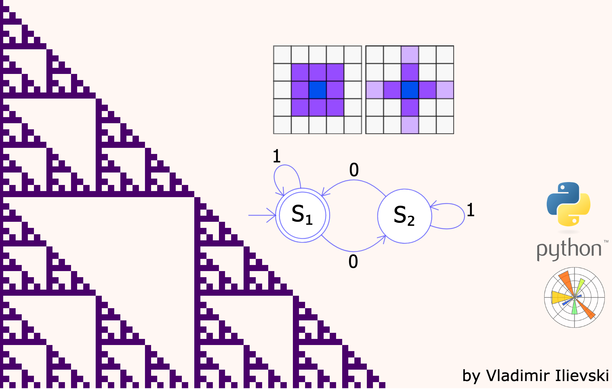

# Cellular Automata in Python

### [Simple but Stunning: Animated Cellular Automata in Python](https://ilievskiv.github.io/blog/2021-05-02-cellular-automata/)

- cellular_automata.ipynb: source code for the cellular automata implementation and
animated visualization