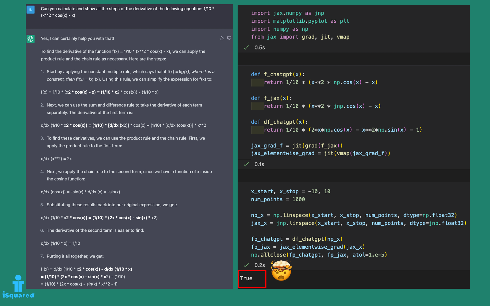

# Differentiation in Python

## [Can ChatGPT differentiate and code it in Python? It seems so!](https://isquared.digital/tips/2023-02-19-chatgpt-derivation/)

Differentiation using ChatGPT with a Python implementation.

Source code:
- derivatives_with_chatgpt.ipynb