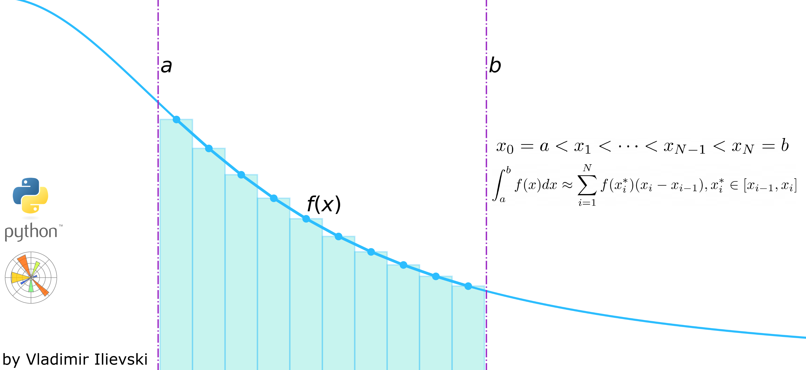
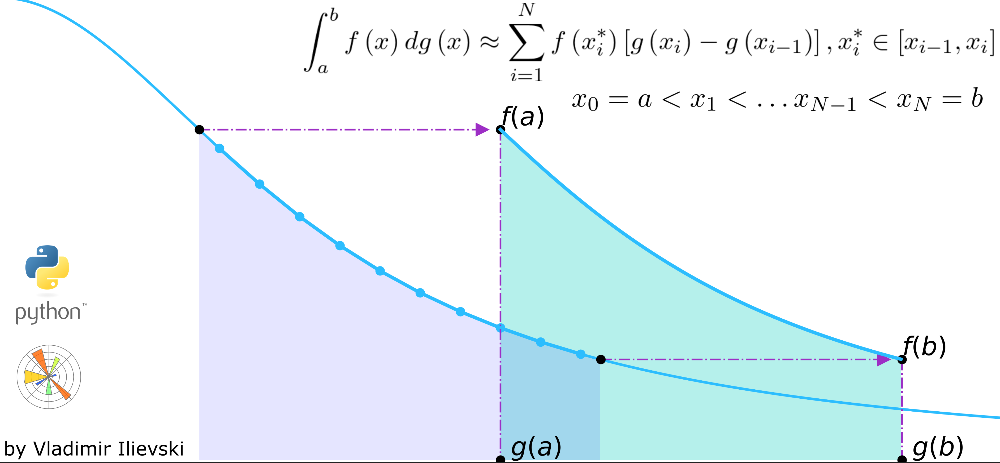

# Nnumerical Integration in Python

### [Integrals are Easy: Visualized Riemann Integration in Python](https://ilievskiv.github.io/blog/2020-05-27-riemann-integration/)

Introduction to the simplest form of Integration using the Riemann sums. We illustrate the numerical integration
process using Matplotlib's Animation API. Source code in file:

- riemann_sums.ipynb

### [Integrals are Fun: Illustrated Riemann-Stieltjes Integral](https://ilievskiv.github.io/blog/2020-10-01-riemann-stieltjes-integration/)

Introduction to the Riemann-Stieltjes Integral which is a generalization of the Riemann Integral. We provide some
intuitive illustrations to explain and understand this type of integral. Source code in file:

- rieman_stieltjes_sums.ipynb