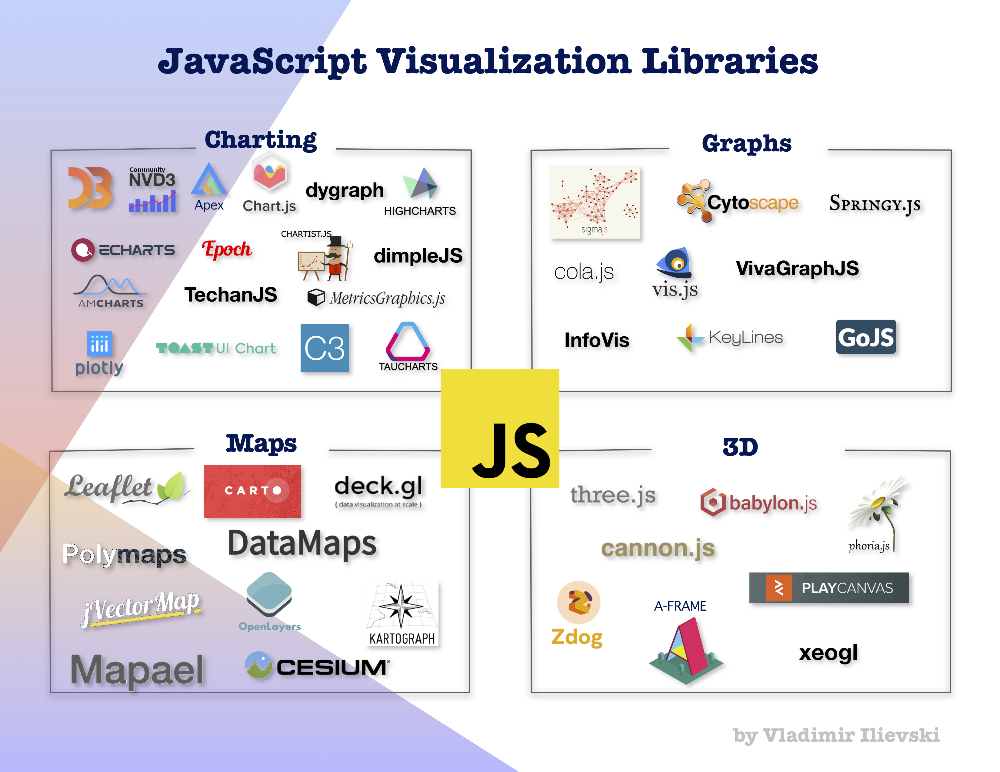

# JavaScript Visualization: Discover Different Visualization Tools

Demonstrating the capabilities of different JavaScript visualization libraries.

## Part 1: Charting tools

### [Data](/JavaScript%20Visualization%20Zoo/Charting/data)
Life expectancy data set from [Our World in Data](https://ourworldindata.org/life-expectancy). We can find the following files:
- life-expectancy.csv: the original data set
- life_expectancy_transform.ipynb: a Python Notebook to transform the data set in different formats
- life-expectancy-nvd.json: JSON format of the data set in a format suitable for NVD3
- life-expectancy-plotly.json: JSON format of the data set in a format suitable for Plotly JS 
- life-expectancy-apex.json: JSON format of the data set in a format suitable for ApexCharts JS 

### [NVD3](/JavaScript%20Visualization%20Zoo/Charting/nvd3)

NVD3 is an open-source library and it is based on D3. Its aim is to bring the power of D3 while removing all unnecessary details and make the chart reproduction as smooth as possible. With its simple look, it can easily serve in the financial and more scientific sectors.

Files:
- index.html: the main HTML file to draw the chart
- chart.js: the main JavaScript code behind the charting

### [Plotly JS](/JavaScript%20Visualization%20Zoo/Charting/plotly)

Plotly JS is a popular open-source JavaScript library built on top of D3. The aim is to provide the organizations a powerful tool to build analytics apps in order to propagate the message of the data more efficiently.

Files:
- index.html: the main HTML file to draw the chart
- chart.js: the main JavaScript code behind the charting

### [ApexCharts JS](/JavaScript%20Visualization%20Zoo/Charting/apex)

ApexCharts JS is an open-source library for interactive charts. Its main goal is to provide the web developers a way to create and integrate in their web applications a large variety of charts in a straightforward manner

Files:
- index.html: the main HTML file to draw the chart
- chart.js: the main JavaScript code behind the charting
- style .css: stlye definition for some parts of the chart

## Part 2: Graph visualization tools

### [Data](/JavaScript%20Visualization%20Zoo/Graphs/datasets)

The dataset we use is the *class dependency network of JDK 1.6.0.7* framework downloaded from the [KOBLENZ data repository](http://konect.uni-koblenz.de/networks/subelj_jdk).

The original data set is stored in the [raw_data](/JavaScript%20Visualization%20Zoo/Graphs/raw_data) and contains the following files:

- *ent.subelj_jdk_jdk.class.name*: each line contains the name of the class prefixed with the package name. The line number is the ID of the node.
- *meta.subelj_jdk_jdk*: metadata information about the dataset
- *out.subelj_jdk_jdk*: all edges between the nodes representing the dependency between the classes

The original data set contains a big number of nodes and edges, thus we select only a small subset of nodes in order to being able to render them here. For this reason with the script [transform_data.ipynb](/JavaScript%20Visualization%20Zoo/Graphs/transform_data.ipynb) we transform the data in the desired format. We select the fifty first nodes and the edges
related to them. The transformed data is stored in [datasets](/JavaScript%20Visualization%20Zoo/Graphs/datasets).

To draw the graph we use the JavaScript library [Cytoscape JS](https://js.cytoscape.org/).