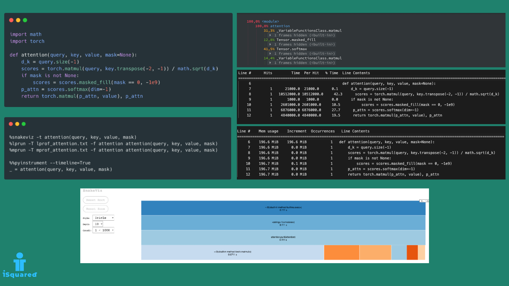

# Python Profilers

## Install dependencies


Make sure you have a Python version compatible with the requirement set in the `pyproject.toml` file. Then,
run the following command:

```bash
poetry install --with profiling
```

## [](https://ilievskiv.github.io/blog/2023-02-06-python-profilers)

<center>
    
</center>