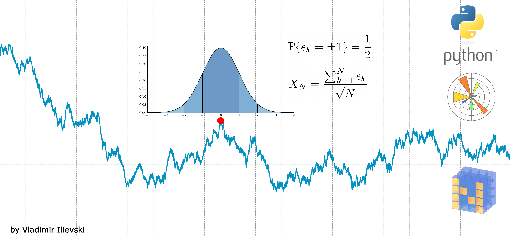
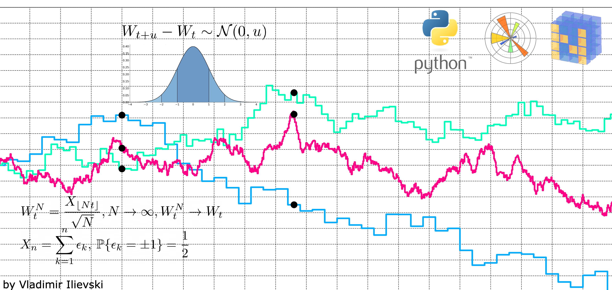
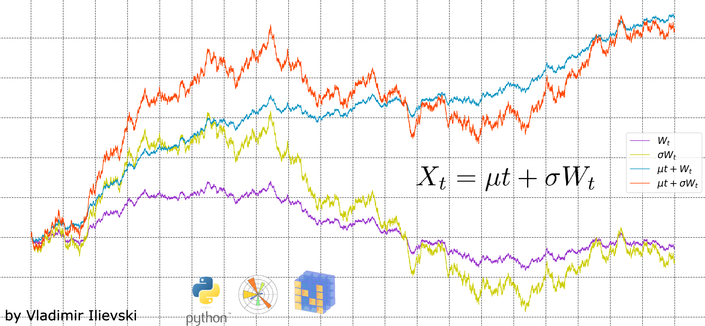
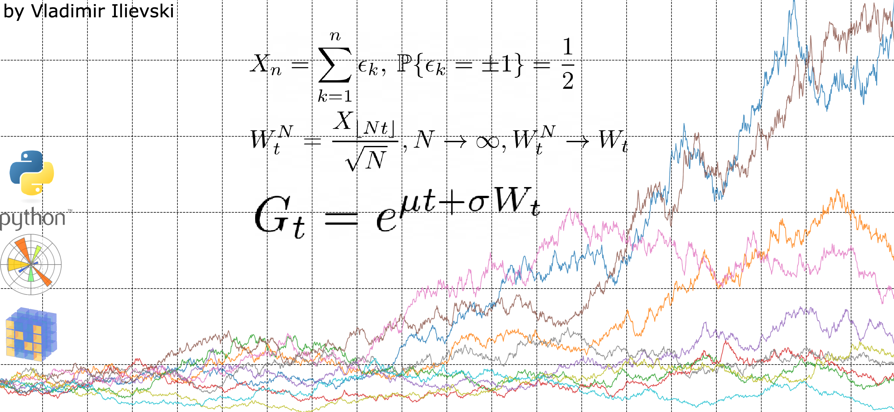

# Random Processes in Python

## [Animated Visualization of Random Walks in Python](https://ilievskiv.github.io/blog/2020-04-12-random-walk/)

Animation of a simple random walk by using the MatplotLib Animation API. Source code in file:

- random_walk_animation.ipynb: the source code for the random walk simulation and animation

## [Animated Visualization of Brownian Motion in Python](https://ilievskiv.github.io/blog/2020-04-16-brownian-motion/)

Illustration of the Brownian Motion construction from a simple random walk using the Donsker's Invariance Principle. Source code in file:

- brownian_motion_animation.ipynb

## [Random Walks Have Never Been Funnier: Drifted Brownian Motion in Python](https://ilievskiv.github.io/blog/2020-05-01-drifted-brownian-motion/)

Extending the bare Brownian Motion with volatility and drift. We illustrate these two proparties with an animated visualization using Matplotlib's Animation API. Source code:

- drifted_brownian_motion.ipynb

### [Forget Determinism, see Randomness in Action: How to Model Stock Price](https://ilievskiv.github.io/blog/2020-05-17-geometric-brownian-motion/)

Transforming the Drifted Brownian Motion from a process with additive increments to a process with multiplicative
increments. This is well suited for modelling stock price data. We analyze and animate one interesting property of
the process: for certain conditions, it has zero mean and infinite variance. Source code:

- geometric_brownian_motion.ipynb