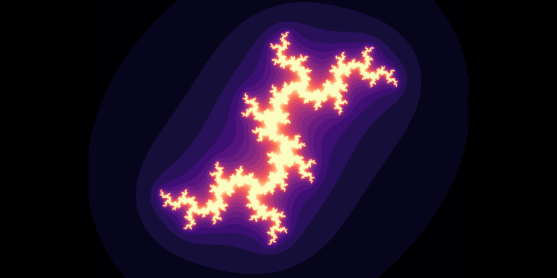
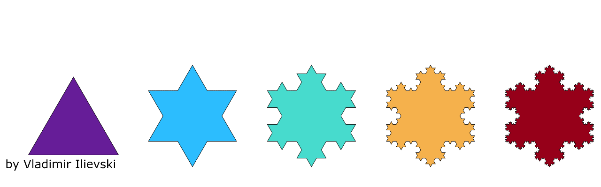
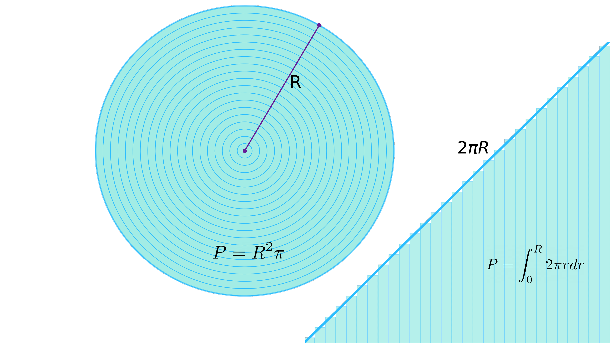
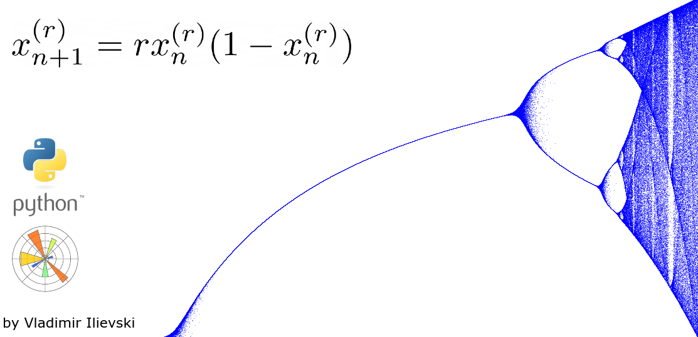
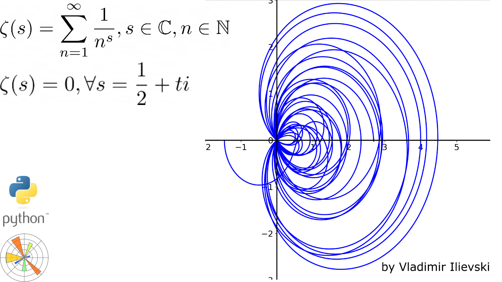

# Visualizations and Animations in Python

## [This is why the Mandelbrot sets are amazing!](https://isquared.digital/visualizations/2020-06-11-mandelbrot/)
## [Julia Set: Animate your own in Python with Matplotlib](https://isquared.digital/visualizations/2020-06-26-julia-set/)

Animated visualization of the Mandelbrot and Julia sets. Source code in files:

- julia_set.ipynb
- mandelbrot.ipynb

## [Visualized Koch Snowflake in Python with Matplotlib](https://isquared.digital/visualizations/2020-06-15-koch-curve/)

How to create and animate a Koch Snowflake in Python with Matplotlib. Soutce code in file:

- snowflake.ipynb

## [Calculation of the Circle’s Area Explained Visually](https://isquared.digital/visualizations/2020-06-07-area-circle/)

How we can visually represent the calculation of the circle's area. Source code in file:

- calculate_area_animation.ipynb

## [Chaotic Beauty: Bifurcation Diagram Animation with Matplotlib](https://ilievskiv.github.io/visualizations/2020-11-18-bufurcation-diagram/)

Animation the Bifurcation Diagram creation by using the MatplotLib Animation API. Source code in file:

- bifurcation_diagram.ipynb: the source code to create the bifurcation diagram

## [Not an ordinary function: Riemann Zeta zeros visualized in Python with Matplotlib](https://isquared.digital/visualizations/2021-02-25-riemann-zeta-zeros)

Visualizing and animating the zeros of the Riemann Zeta function, which are still not mathematically
proven to hold in all cases.

- riemann_zeta_zeros.ipynb: the source code of the visualization